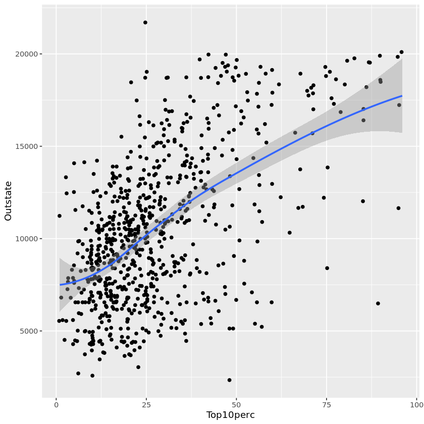
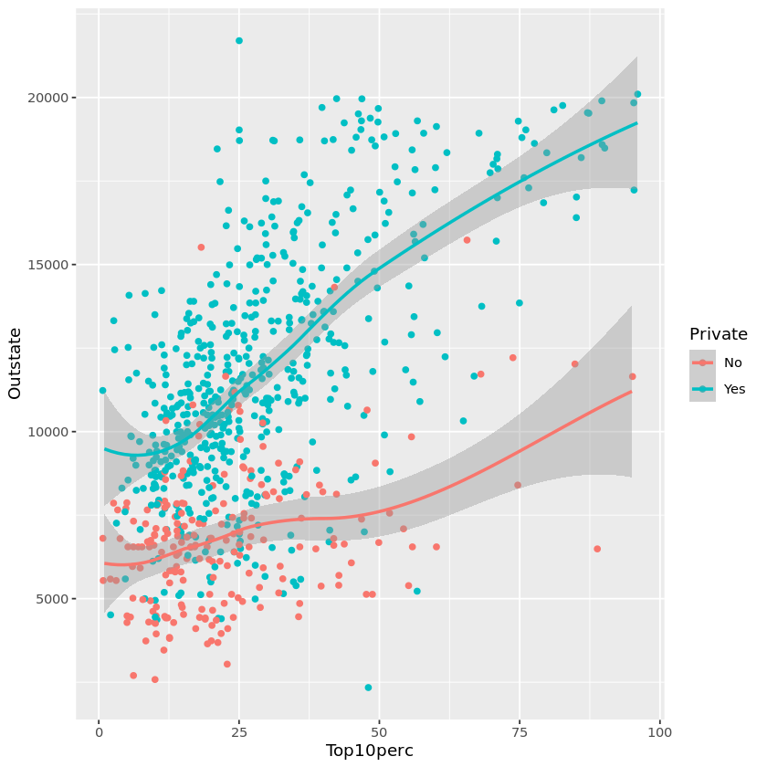
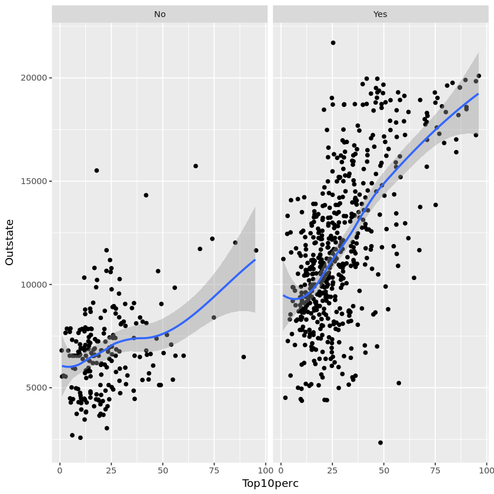
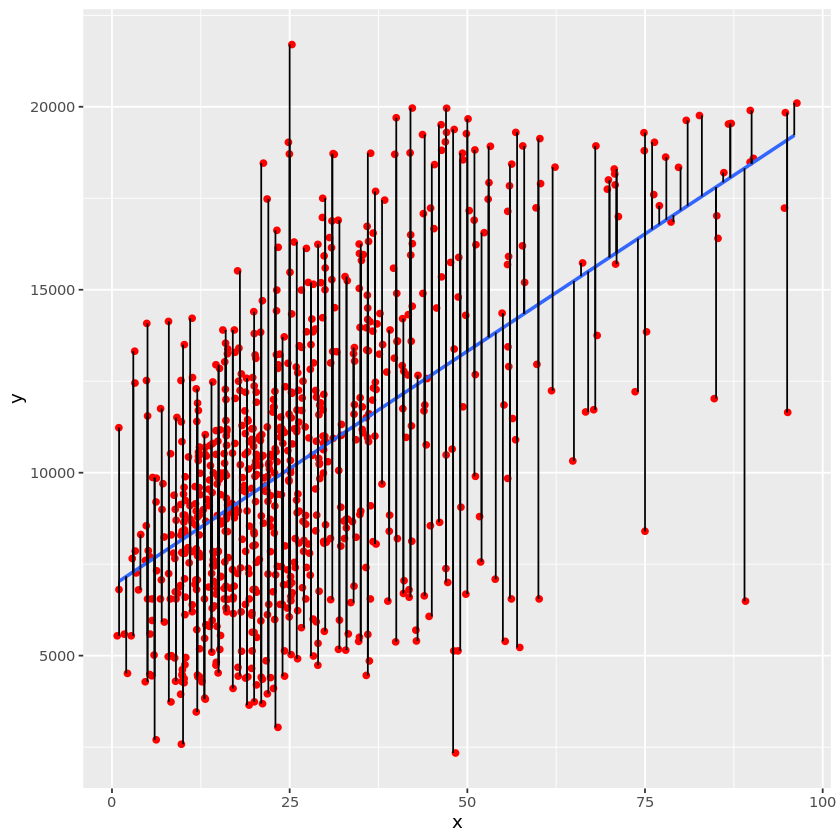

# Data Science and Analytics Homework 2 Solutions


```R
# Add Libraries
library(ggplot2)
library('ISLR')
library(tidyverse)

```

Create a scatterplot with the percentage of students from the top 10% of their high school class on the 𝑥 axis and the out-of-state tuition on the 𝑦 axis. Overlay the points with a  smoothed line and 95% confidence bands. Remember to avoid overplotting.  


```R
ggplot(mapping = aes(x = Top10perc, y = Outstate)) + 
    geom_jitter() + 
    geom_smooth() 
```

    `geom_smooth()` using method = 'loess' and formula 'y ~ x'
    


    

    


We will compare relationships between the percentage of students from the top 10% of their 
high school class and out-of-state tuition at public and private colleges.  
 
a. [10 points] Using different colored points for public and private colleges, create a scatterplot 
with the percentage of students from the top 10% of their high school class on the 𝑥 axis and 
the out-of-state tuition on the 𝑦 axis. Overlay each set of points with a smoothed line of the 
same color with 95% confidence bands. Remember to avoid overplotting. 


```R
ggplot(mapping = aes(x = Top10perc, y = Outstate,  
 color = Private)) +  
        geom_jitter() + 
        geom_smooth() 
```

    `geom_smooth()` using method = 'loess' and formula 'y ~ x'
    


    

    


Using faceting, create side-by-side scatterplots for public and private schools, with 
the number of students from the top 10% of their high school class on each 𝑥 axis and the out-
of-state tuition on each 𝑦 axis. Overlay each scatterplot with a smoothed line with 95% 
confidence bands. Remember to avoid overplotting.  


```R
ggplot(College, mapping = aes(x = Top10perc, y = Outstate)) + 
facet_wrap(~ Private) + 
  geom_jitter() + 
  geom_smooth() 
```

    `geom_smooth()` using method = 'loess' and formula 'y ~ x'
    


    

    


Create a scatterplot with the feature on the 𝑥 axis and the response on the 𝑦 axis.
Remember to avoid overplotting. Overlay the scatterplot with the least squares regression line
and 95% confidence bands.


```R
ggplot(mapping = aes(x = Top10perc, y = Outstate)) +
  geom_jitter() +
  geom_smooth(method = "lm")
```

    `geom_smooth()` using formula 'y ~ x'
    


    

    


Examine the fit of the least squares linear model for a college’s out-of-state tuition from
the percentage of students from the top 10% of their high school class. 


```R
x <- Top10perc
y <- Outstate
ggplot(mapping = aes(x = x, y = y)) +
     geom_jitter(color="red") +
     geom_smooth(method=lm, se=FALSE) +
     geom_segment(aes(x=x, xend=x, y=y, yend=lm(y ~ x)$fitted.values))
```

    `geom_smooth()` using formula 'y ~ x'
    


    

    


Briefly explain what the vertical line segments in your plot from graph represented. Then
explain why the points are not perfectly aligned with these line segments.

The vertical line segments represent residuals, or differences between observed (points) and
predicted (line) values of Outstate. The points are not perfectly aligned with these line
segments because we applied jittering to avoid overplotting. 
